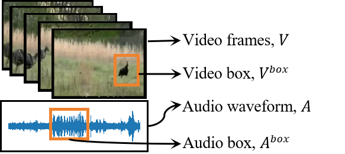
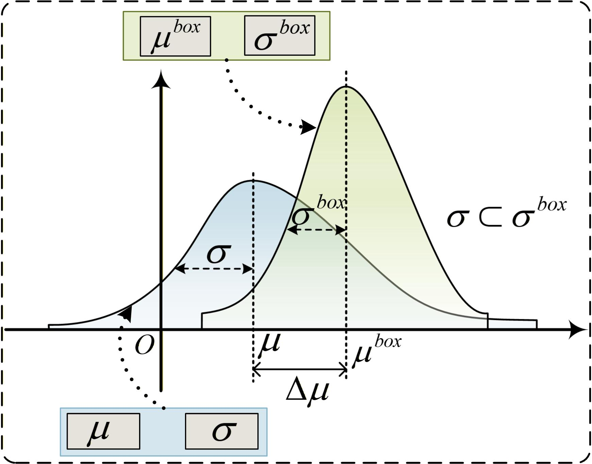

# General-to-Specific Subsumption Learning for Audio-Visual Generalized Zero-Shot Learning
This repository is the official implementation.
<p float="left">
  
  
</p>

## 1.Create environment
Run the following command to install the required packages:
```bash
pip install -r requirements.txt
```

## 2.Obtaining Datasets
### Option 1: Downloading our features
If you want to use our extracted data features, please download them from: 

VGGSound-GZSL features: [here](https://pan.baidu.com/s/1ctvvEFt7NTDgcfE7vhHJDg?pwd=jbzx)

UCF-GZSL features:[here](https://pan.baidu.com/s/1oVS6EnfZHq408TYSfcdfIg?pwd=692t)

ActivityNet-GZSL features:[here](https://pan.baidu.com/s/1bbqDERYXACyP04Cb6GqDNg?pwd=khgn)

Due to copyright restrictions, we do not share the `class-split` files in this section. Please download them from [here](https://github.com/dkurzend/ClipClap-GZSL)                                                         
                                                                                                                                                                                                                            
After downloading, please modify the `data_dir` in config `/my_zero_shot.yaml` and path in `dataset_all/VGGSound_ZSL.py`, `dataset_all/ActivityNet_ZSL.py`, `dataset_all/UCF_ZSL.py`.                                       
                                                                                                                                                                                                                            
The daraset directory is organized into the following structure:                                                                                                                                                            
```text                                                                                                                                                                                                                     
data_root/                                                                                                                                                                                                                  
├── class-split/                                                                                                                                                                                                            
│   ├── all_class.txt                                                                                                                                                                                                       
│   └── cls_split/                                                                                                                                                                                                          
│       ├── stage_1_train.txt                                                                                                                                                                                               
│       ├── stage_1_train.csv                                                                                                                                                                                               
│       ├── stage_1_val_seen.txt                                                                                                                                                                                            
│       ├── stage_1_val_seen.csv                                                                                                                                                                                            
│       ├── stage_1_val_unseen.txt                                                                                                                                                                                          
│       ├── stage_1_val_unseen.csv                                                                                                                                                                                          
│       ├── stage_2_train.txt                                                                                                                                                                                               
│       ├── stage_2_train.csv                                                                                                                                                                                               
│       ├── stage_2_test_seen.txt                                                                                                                                                                                           
│       ├── stage_2_test_seen.csv                                                                                                                                                                                           
│       ├── stage_2_test_unseen.txt                                                                                                                                                                                         
│       └── stage_2_test_unseen.csv                                                                                                                                                                                         
└── GZSL_data/                                                                                                                                                                                                              
    ├── text_embedding.pt                                                                                                                                                                                                   
    ├── stage_1_train.pt                                                                                                                                                                                                    
    ├── stage_1_val.pt                                                                                                                                                                                                      
    ├── stage_2_train.pt                                                                                                                                                                                                    
    └── stage_2_test.pt                                                                                                                                                                                                     
 ```                                                                                                                                                                                                                        
### Option 2: Extracting Features from Scratch                                                                                                                                                                              
                                                                                                                                                                                                                            
To extract features from scratch, you first need to acquire the original datasets ( VGGSound, ActivityNet, UCF). For detailed dataset acquisition steps, please refer to [Link](https://github.com/ExplainableML/AVCA-GZSL).
                                                                                                                                                                                                                            
Due to data copyright restrictions, you will need to download and filter the corresponding  samples used for GZSL by yourself, according to the `.csv` files provided in the `class-split/` directory.                      
The codes and guidelines for extracting boxes and embeddings will be released in the future.                                                                                                                                
                                                                                                                                                                                                                            
## 3.Training                                                                                                                                                                                                               
                                                                                                                                                                                                                            
### option 1.Quick Start                                                                                                                                                                                                    
To train the model on the VGGSound-GZSL dataset, you can simply run the provided shell script:                                                                                                                              
```bash                                                                                                                                                                                                                     
bash run_VGGSound.sh                                                                                                                                                                                                        
```                                                                                                                                                                                                                         
(Note: You can similarly run scripts for other datasets like run_ActivityNet.sh or run_UCF.sh)                                                                                                                              
                                                                                                                                                                                                                            
### option 2.Manual Training                                                                                                                                                                                                
You can execute `main.py` with custom arguments on VGGSound-GZSL:                                                                                                                                                           
```bash                                                                                                                                                                                                                     
python main.py \                                                                                                                                                                                                            
    --dataset VGGSound \                                                                                                                                                                                                    
    --data_dir "" \                                                                                                                                                                                                         
    --run all \                                                                                                                                                                                                             
    --exp_name training \                                                                                                                                                                                                   
    --modality both  \                                                                                                                                                                                                      
    --lr 0.0001 \                                                                                                                                                                                                           
    --epochs 10 \                                                                                                                                                                                                           
    --batch_size 64 \                                                                                                                                                                                                       
    --n_batches 300 \                                                                                                                                                                                                       
    --mapper_hidden_size 128 \                                                                                                                                                                                              
    --enc_hidden_size 128 \                                                                                                                                                                                                 
    --dropout 0.3 \                                                                                                                                                                                                         
    --margin_ratio 2.0                                                                                                                                                                                                      
```                                                                                                                                                                                                                         
On ActivityNet-GZSL:                                                                                                                                                                                                        
```bash                                                                                                                                                                                                                     
python main.py \                                                                                                                                                                                                            
    --dataset ActivityNet \                                                                                                                                                                                                 
    --data_dir "" \                                                                                                                                                                                                         
    --run all \                                                                                                                                                                                                             
    --exp_name training \                                                                                                                                                                                                   
    --modality both  \                                                                                                                                                                                                      
    --lr 0.0001 \                                                                                                                                                                                                           
    --epochs 10 \                                                                                                                                                                                                           
    --batch_size 64 \                                                                                                                                                                                                       
    --n_batches 300 \                                                                                                                                                                                                       
    --mapper_hidden_size 512 \                                                                                                                                                                                              
    --enc_hidden_size 512 \                                                                                                                                                                                                 
    --dropout 0.1 \                                                                                                                                                                                                         
    --margin_ratio 2.0                                                                                                                                                                                                      
```                                                                                                                                                                                                                         
You can execute `main.py` with custom arguments on UCF-GZSL:                                                                                                                                                                
```bash                                                                                                                                                                                                                     
python main.py \                                                                                                                                                                                                            
    --dataset UCF \                                                                                                                                                                                                         
    --data_dir "" \                                                                                                                                                                                                         
    --run all \                                                                                                                                                                                                             
    --exp_name training \                                                                                                                                                                                                   
    --modality both  \                                                                                                                                                                                                      
    --lr 0.00007 \                                                                                                                                                                                                          
    --epochs 18 \                                                                                                                                                                                                           
    --batch_size 64 \                                                                                                                                                                                                       
    --n_batches 300 \                                                                                                                                                                                                       
    --mapper_hidden_size 512 \                                                                                                                                                                                              
    --enc_hidden_size 512 \                                                                                                                                                                                                 
    --dropout 0.1 \                                                                                                                                                                                                         
    --margin_ratio 2.0                                                                                                                                                                                                      
```                                                                                                                                                                                                                         
                                                                                                                                                                                                                            
## 4.Evaluation                                                                                                                                                                                                             
                                                                                                                                                                                                                            
We provide two ways to evaluate the model's performance: **Automatic Evaluation** during training and **Manual Evaluation** using pre-trained weights.                                                                      
### option 1.Automatic Evaluation                                                                                                                                                                                           
If you want the model to automatically evaluate its performance on the test set during the training process, simply set the `--run` argument to `all`.                                                                      
### option 2.Manual Evaluation                                                                                                                                                                                              
For manual evaluation run the following command:                                                                                                                                                                            
```angular2html                                                                                                                                                                                                             
python get_evaluation.py \                                                                                                                                                                                                  
    --load_path_stage_A  "" \                                                                                                                                                                                               
    --load_path_stage_B "" \                                                                                                                                                                                                
    --dataset_name VGGSound \                                                                                                                                                                                               
    --data_dir "" \                                                                                                                                                                                                         
    --exp_name eval \                                                                                                                                                                                                       
```                                                                                                                                                                                                                         
```angular2html                                                                                                                                                                                                             
arguments:                                                                                                                                                                                                                  
--load_path_stage_A will indicate to the path that contains the network for stage 1                                                                                                                                         
--load_path_stage_B will indicate to the path that contains the network for stage 2                                                                                                                                         
--dataset_name {VGGSound, UCF, ActivityNet} will indicate the name of the dataset                                                                                                                                           
--data_dir points to the location where the dataset is stored                                                                                                                                                               
```                                                                                                                                                                                                                         
                                                                                                                                                                                                                            
## Model Weights                                                                                                                                                                                                            
Our fully trained model weights are available for download [here](https://pan.baidu.com/s/1CTdoG2jFQWtc6opZ9FZHOg?pwd=2vzy ).                                                                                                                                                            
                                                                                                                                                                                                                            
To use these pre-trained weights for evaluation, please specify the path of  'stage1 .pt' file directory in `load_path_stage_A`, and the 'stage2 .pt' file directory in `load_path_stage_B` (in config/my_zero_shot.yaml).  

